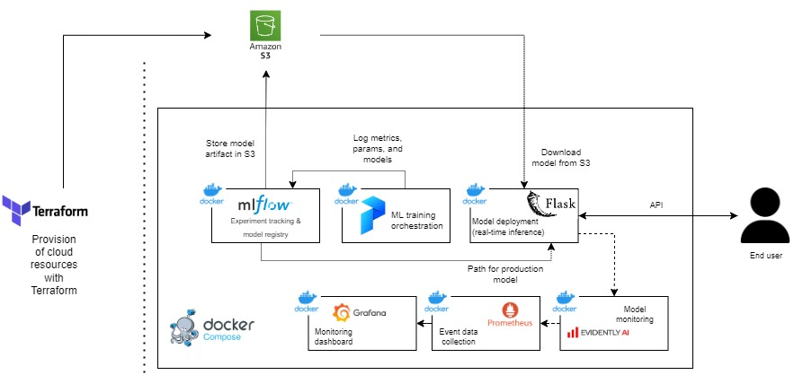
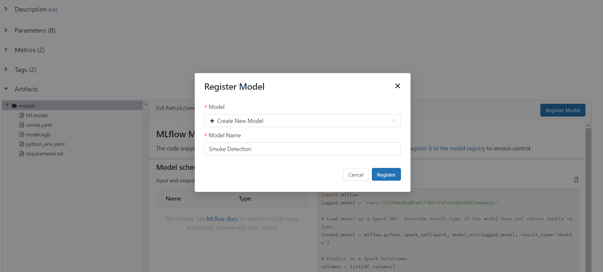
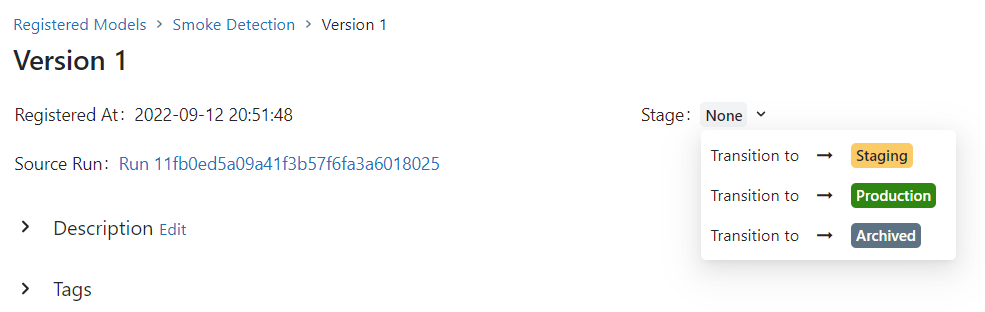

# MLops Project: Smoke Detection Model
[](https://github.com/psf/black)

This project is created to learn best practices of MLops and submitted as a project by Ammar Chalifah in DataTalksClub's MLops Zoomcamp which i enrolled in to practise mlops.

# Project Background and Overview
The goal of this project is to build an end-to-end MLops to train, store, register, deploy, serve, and monitor ML model. The problem that this project aiming to solve is to create a pipeline of smoke detection model (binary classification), using public data shared on Kaggle.



The solution overview:
- Cloud resource provision using IaC tool (Terraform)
- ML experiment tracking & model registry using MLflow
- Orchestration of ML pipeline using Prefect
- ML deployment using Flask (real-time inference)
- ML monitoring (real-time) using Evidently, Grafana, and Prometheus

# Getting Started
Clone this repository and follow the guide below.

## S3 Provision with Terrform
***
First, create a new S3 bucket using Terraform (IaC tool). Open `01_terraform/main.tf` and change the bucket name:
```
resource "aws_s3_bucket" "b" {
  bucket = "{YOUR_BUCKET_NAME}"

  tags = {
    Name = "MLops bucket"
  }
}
```
Create the bucket by executing
```
> cd 01_terraform
> terraform init
> terraform plan
> terraform apply
> cd ..
```

## Run MLflow tracking server
***
First, run the MLflow webserver and database by running
```
docker-compose --profile mlflow up
```
MLflow webserver is ran inside a container that exposes port 5000 with the host machine. To access the web UI, open web browser and navigate to `http://localhost:5000`.

## Run Prefect (Orchestrator)
***
To run Prefect, first run the webserver (Prefect Orion) and Database by running
```
docker-compose --profile orion up
```
The server can be accessed on `http://localhost:4200`

You can run a flow from another container that is connected to the Orion API by running Prefect CLI container
```
docker-compose run prefect_cli
```
To run the Prefect Flow, run `python model_training.py` from inside the `prefect_cli` container. The command will execute the Flow to train several models (RandomForest, LightGBM, XGBoost, and CatBoost), and do hyperparameter tuning for XGBoost. The model artifacts are stored in S3 bucket.

Finally, run Prefect Agent to execute tasks in queue that already being scheduled in Prefect deployments by running
```
docker-compose --profile agent up
```

## Model Registry
***
Open MLflow server and choose the model to deploy to production.

Select the best performing model from MLflow Tracking Server UI, and register the model to MLflow Model Registry.



After registering the model, select one best performing model and change the state to production.



## Model Deployment & Monitoring
***
Deploy the production-ready model with real-time inference by running it inside a Flask application, that is ran inside a Docker container. At the same time, run monitoring services as well (MongoDB, Prometheus, and Grafana).
```
docker-compose --profile monitoring up
```
Test the service by executing `prediction_test.py`

To monitor the data, access it on Grafana `http://localhost:3000`

## Best Practices
- To run each container as background service, add `-d` flag behind the command to daemonize it. This will keep your terminal clean and keep you uninterrupted.
- Install pre-commit to automatically format (with black) and do some checks when committing.
- CI test during push to remote with GitHub workflow

## References
- Reference for this docker-compose architecture & code (MLflow part): https://towardsdatascience.com/deploy-mlflow-with-docker-compose-8059f16b6039
- Reference for the prefect docker-compose: https://github.com/rpeden/prefect-docker-compose
- Reference for the Prefect orchestrator: https://github.com/hakymulla/Diabetes-ML-ps
- Reference for Monitoring architecture: https://github.com/AntonisCSt/Mlops_project_semicon/blob/main/evidently_service/Dockerfile
